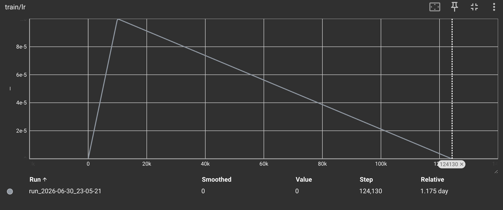
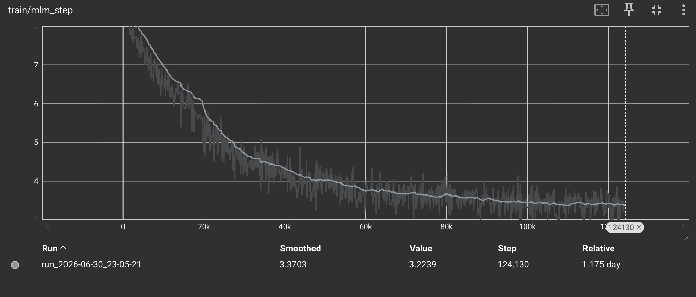
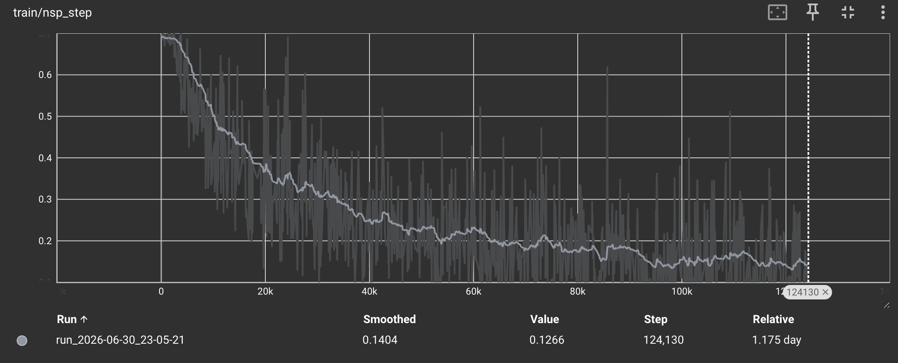
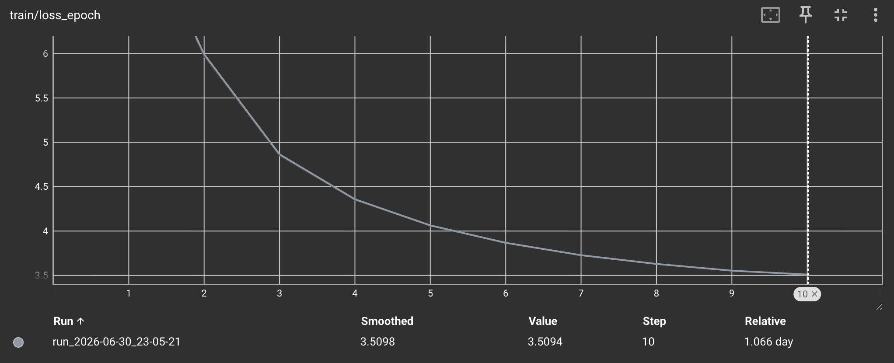
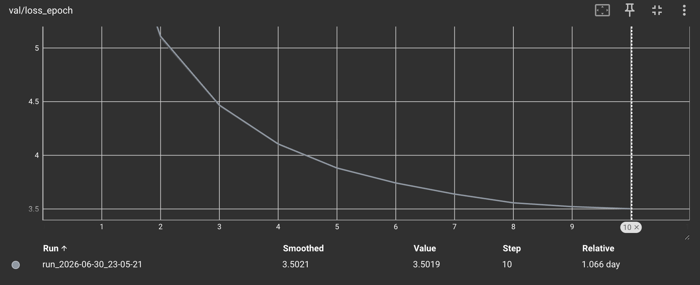
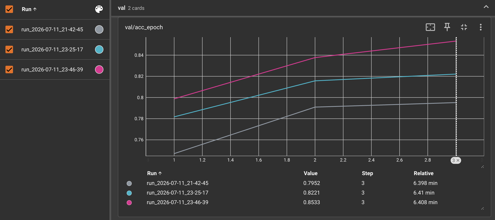
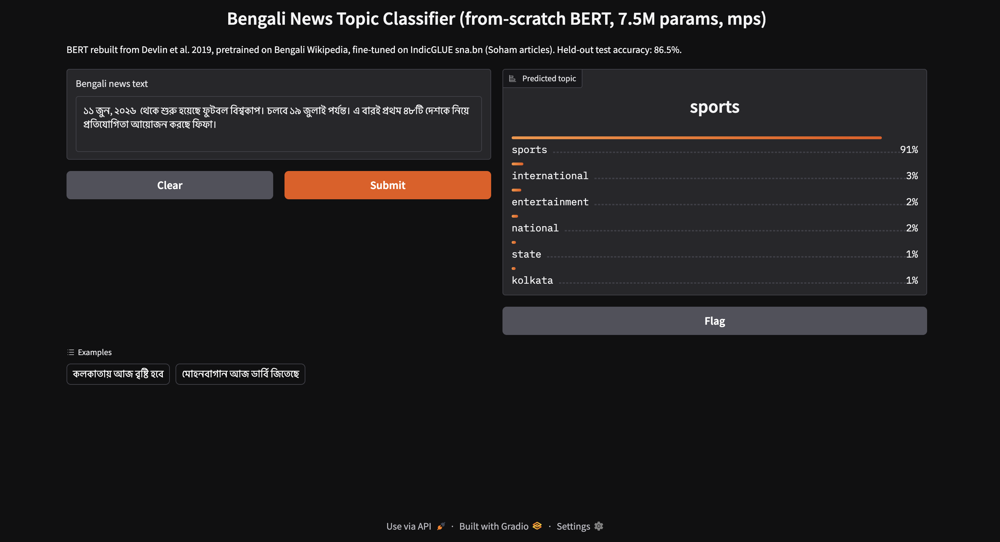

**No CUDA, no TPU pod, no `from_pretrained`.** A 7.5M-parameter BERT, pre-trained from random weights on Bengali Wikipedia on a single 16GB M1 — both self-supervised objectives written by hand from the paper *and* Google's released code — then fine-tuned onto a published IndicGLUE leaderboard.

[Source on GitHub](https://github.com/SamyamoyRakshit/papers-from-scratch/tree/main/BERT)


## Start with the scorecard

Most write-ups save the numbers for the end. This one opens with them, because the number is the reason the project exists.

The downstream task is **IndicGLUE `sna.bn`** — the Soham Bengali news-article classification set, from AI4Bharat's [IndicNLPSuite](https://aclanthology.org/2020.findings-emnlp.445.pdf) (Kakwani et al., 2020). It ships fixed splits — **6 classes, 11,284 train / 1,411 test** — and the paper reports mBERT, IndicBERT, and XLM-R fine-tuned on exactly those splits. So a from-scratch model can be dropped onto a real, published leaderboard with no asterisks about "different data."

Here is where a **7.5M-parameter, Bengali-only** BERT — built by hand and pre-trained from random weights on one 16GB laptop — lands (all baselines from the paper's Table 9; IndicFT from Table 4):

| system | params | pre-training | `sna.bn` test acc |
|---|---|---|---|
| IndicFT word vectors + k-NN | — | word embeddings only | 71.82 |
| IndicBERT base (ALBERT, 12 langs) | 12M | 7.59B Indic tokens · 1× TPU v3 · 6 days | 78.45 |
| mBERT (104 langs) | 110M | Wikipedia · ~18.2B tokens (est.) | 80.23 |
| **this replication (Bengali only, from scratch)** | **~7.5M** | **114 MB Bengali Wikipedia · 1 laptop · 28 h** | **86.5** |
| XLM-R base (100 langs) | 125M | 2.5 TB CommonCrawl | **87.60** |

Second place, above the two BERT-family baselines, a point behind XLM-R at ~17× the size by the paper's own parameter counts. That result is real and reproducible — and [later in this article](#the-number-read-carefully) I spend as much space on *why it should be read carefully* as on the number itself, because the comparison is a statement about **specialization**, not about anyone's model being weak.

The rest of this piece is how a laptop got there: the model built module by module, both objectives written from scratch, the pre-training run in full, and the honest scorecard. Every claim points at the real source file so you can read the code, not a summary of it. It's a deliberate sibling of [a from-scratch Transformer](/blog/attention-from-scratch/) built the same way — and BERT reuses that project's attention and LayerNorm unchanged, so where the two meet, this article says so.


---

## Why pre-train from scratch — and why in Bengali, against a benchmark?

Fine-tuning BERT is a one-liner. *Pre-training* one — from random weights, with the masking and the sentence-pairing and the joint loss all written by hand — is a genuinely different exercise, and it teaches three things a download never does.

**It forces you to read the code, not the paper.** BERT's paper is a dozen pages, and a startling amount of what makes the model *work* isn't in them — the LayerNorm after the embedding sum, the tanh form of GELU, the `1e-6` Adam epsilon, the different-document negative sampling, the `0.02` init. All of that lives in Google's released TensorFlow, and half of it silently contradicts the prose. You cannot replicate BERT faithfully from the paper alone; you have to diff the paper against the code, and that diff is most of the education.

**It makes the 16GB ceiling the teacher.** The paper pre-trained BERT-base (110M params) on **16 TPU chips (4 Cloud TPUs) for four days**. This ran on one Apple M1 with 16GB of unified memory shared with the OS and the browser. The full model doesn't fit, so every dimension becomes a negotiation and you learn what each tensor costs — the exact discipline a cluster lets you skip.

**It puts the result somewhere it can be judged.** Pre-training in **Bengali** — a morphologically rich, lower-resource language — and evaluating on IndicGLUE means the model isn't graded on vibes. It lands next to 110M-parameter multilingual models on a benchmark those same authors built. The honest gap to XLM-R, and the honest margin over mBERT, are both the point.

---

## One encoder, two lives

BERT is the **encoder half** of the Transformer, and it lives twice.

**Life one — pre-training** (self-supervised, no labels). Read a mountain of raw text and learn language by filling in blanked-out words (Masked LM) and judging whether one sentence follows another (Next Sentence Prediction). What comes out is a general-purpose encoder: a stack that turns any sentence into context-rich vectors.

**Life two — fine-tuning** (supervised, tiny). Discard the two pre-training heads, bolt a small task head onto the same encoder, and train briefly on labelled data. The encoder does the work; the head just reads it out.

<style>
  /* Presentation attributes on each element are the always-works layer (plain
     hex, survives any renderer that strips this block). These rules re-style the
     same elements through the site tokens — CSS beats a presentation attribute,
     so on the site the diagram themes with the ThemeToggle. */
  .dgm{background:var(--code-bg, oklch(0.97 0.0022 95));border:1px solid var(--rule, oklch(0.868 0.0038 95));border-radius:14px;padding:20px 14px;overflow-x:auto;margin:1.6rem 0}
  .dgm svg{display:block;width:100%;height:auto;margin:0 auto}
  .dgm text{font-family:var(--f-mono, ui-monospace,SFMono-Regular,Menlo,monospace)}
  .dg-xink{fill:var(--ink, oklch(0.23 0.023 258))}
  .dg-xmut{fill:var(--ink-muted, oklch(0.42 0.021 258))}
  .dg-xaccent{fill:var(--accent, oklch(0.47 0.175 268))}
  .dg-xamberfg{fill:var(--tint-amber-fg, oklch(0.445 0.09 65))}
  .dg-xskyfg{fill:var(--tint-sky-fg, oklch(0.435 0.114 250))}
  .dg-xvioletfg{fill:var(--tint-violet-fg, oklch(0.44 0.145 300))}
  .dg-xmintfg{fill:var(--tint-mint-fg, oklch(0.42 0.081 168))}
  .dg-xrosefg{fill:var(--tint-rose-fg, oklch(0.44 0.13 25))}
  /* The tensor boxes — inputs, the three embedding tables, sequence_output,
     pooled [CLS], the spec chips. A slate, mixed from the accent so it is one
     material rather than a fifth hue competing with the four the modules use.
     `in oklab` and not `in oklch`: oklch would interpolate the HUE, and the
     short arc from the paper's 95 to the accent's 268 runs through green, so
     the "cool grey" comes out olive. Oklab is rectangular and has no arc.
     Mixed off --paper-raised, not --paper-sunken: in the dark theme sunken
     (L 0.172) sits BELOW the diagram's own ground (--code-bg, L 0.180), so
     every one of these boxes was a hole rather than an object, and at 8
     thousandths of lightness apart, an invisible one. */
  .dg-node{fill:color-mix(in oklab, var(--accent) 10%, var(--paper-raised));stroke:color-mix(in oklab, var(--accent) 28%, var(--rule))}
  /* The two pre-training heads, dashed because the transplant throws them away.

     Rose — the fifth tint, added to global.css for this. Every reuse was tried
     first and every one of them failed, which is the argument for the token:

       sky, violet   nearest of the four to the tensor slate directly above
                     these boxes (0.022 apart in oklab, light theme). Muddy.
       amber         furthest on the numbers, and it is the Classifier sitting
                     in the same row. Three amber boxes side by side destroyed
                     the discarded/kept distinction the row exists to draw.
       mint          already the Input Embeddings block at the top.

     Before that, two attempts separated these by LIGHTNESS rather than hue — a
     paler grey, then bare --paper-raised — and both collapsed in the dark
     theme, where the range compresses to about 0.05 and the two boxes read as
     one box with a different border. Hue holds where lightness does not, and
     red is what "thrown away" has always looked like. */
  .dg-leafno{fill:var(--tint-rose-bg, oklch(0.933 0.033 20));stroke:var(--tint-rose-fg, oklch(0.44 0.13 25))}
  .dg-amber{fill:var(--tint-amber-bg, oklch(0.942 0.042 85));stroke:var(--tint-amber-fg, oklch(0.445 0.09 65))}
  .dg-sky{fill:var(--tint-sky-bg, oklch(0.933 0.033 245));stroke:var(--tint-sky-fg, oklch(0.435 0.114 250))}
  .dg-violet{fill:var(--tint-violet-bg, oklch(0.933 0.031 300));stroke:var(--tint-violet-fg, oklch(0.44 0.145 300))}
  .dg-mintbox{fill:var(--tint-mint-bg, oklch(0.933 0.035 165));stroke:var(--tint-mint-fg, oklch(0.42 0.081 168))}
  .dg-flow{stroke:var(--ink-muted, oklch(0.42 0.021 258))}
  .dg-mem{stroke:var(--accent, oklch(0.47 0.175 268))}
  .dg-group{stroke:var(--rule-strong, oklch(0.615 0.006 95))}
  .dg-ahflow{fill:var(--ink-muted, oklch(0.42 0.021 258))}
  .dg-ahmem{fill:var(--accent, oklch(0.47 0.175 268))}
  /* On a phone, scroll the diagram rather than shrink it — same reasoning as
     the Transformer post: these viewBoxes are 700 wide, and fitting one into a
     358px column scales the 10.5-14px labels down to 5-7px. A flow chart whose
     labels cannot be read is decoration. The container already scrolls. */
  @media (max-width: 40rem){
    .dgm svg{min-width:620px}
  }
</style>
<figure class="dgm">
  <svg viewBox="0 0 700 300" width="700" height="300" style="max-width:100%;height:auto" font-family="ui-monospace, SFMono-Regular, Menlo, Consolas, monospace" role="img" aria-label="The same six-layer encoder in two lives: pre-trained on Bengali Wikipedia behind MLM and NSP heads, then transplanted into fine-tuning on IndicGLUE sna.bn behind a single linear classifier.">
    <defs><marker id="dgahA-flow" viewBox="0 0 9 9" refX="7.5" refY="4.5" markerWidth="6.5" markerHeight="6.5" orient="auto-start-reverse"><path class="dg-ahflow" d="M0,0 L9,4.5 L0,9 z" fill="#464e59"/></marker><marker id="dgahA-mem" viewBox="0 0 9 9" refX="7.5" refY="4.5" markerWidth="6.5" markerHeight="6.5" orient="auto-start-reverse"><path class="dg-ahmem" d="M0,0 L9,4.5 L0,9 z" fill="#324ebb"/></marker></defs>
    <path class="dg-group" d="M340,10 V138" fill="none" stroke="#868581" stroke-width="1.3" stroke-linecap="round" stroke-dasharray="5 4"/>
    <path class="dg-group" d="M340,190 V292" fill="none" stroke="#868581" stroke-width="1.3" stroke-linecap="round" stroke-dasharray="5 4"/>
    <text class="dg-hd dg-xink dg-c" x="165" y="24" fill="#161d28" font-size="13" font-weight="700" letter-spacing=".12em" text-anchor="middle">LIFE 1 — PRE-TRAIN</text>
    <text class="dg-tag dg-xmut dg-c" x="165" y="42" fill="#464e59" font-size="10.5" font-weight="400" letter-spacing=".04em" text-anchor="middle">self-supervised · once · ~28 h</text>
    <text class="dg-hd dg-xink dg-c" x="515" y="24" fill="#161d28" font-size="13" font-weight="700" letter-spacing=".12em" text-anchor="middle">LIFE 2 — FINE-TUNE</text>
    <text class="dg-tag dg-xmut dg-c" x="515" y="42" fill="#464e59" font-size="10.5" font-weight="400" letter-spacing=".04em" text-anchor="middle">supervised · ~9.5 min</text>
    <text class="dg-lbl dg-xink dg-c" x="165" y="74" fill="#161d28" font-size="14" font-weight="600" text-anchor="middle">Bengali Wikipedia</text>
    <text class="dg-sub dg-xmut dg-c" x="165" y="91" fill="#464e59" font-size="11" font-weight="400" text-anchor="middle">raw text · no labels</text>
    <text class="dg-lbl dg-xink dg-c" x="515" y="74" fill="#161d28" font-size="14" font-weight="600" text-anchor="middle">IndicGLUE sna.bn</text>
    <text class="dg-sub dg-xmut dg-c" x="515" y="91" fill="#464e59" font-size="11" font-weight="400" text-anchor="middle">labelled news · 6 classes</text>
    <path class="dg-flow" d="M165,100 V128" fill="none" stroke="#464e59" stroke-width="1.8" stroke-linecap="round" marker-end="url(#dgahA-flow)"/>
    <path class="dg-flow" d="M515,100 V128" fill="none" stroke="#464e59" stroke-width="1.8" stroke-linecap="round" marker-end="url(#dgahA-flow)"/>
    <rect class="dg-violet" x="75" y="136" width="180" height="54" rx="12" fill="#ece5fb" stroke="#603995" stroke-width="1.4"/>
    <text class="dg-lbl dg-xvioletfg dg-c" x="165" y="159" fill="#603995" font-size="14" font-weight="600" text-anchor="middle">6-layer encoder</text>
    <text class="dg-sub dg-xvioletfg dg-c" x="165" y="177" fill="#603995" font-size="11" font-weight="400" text-anchor="middle">d_model 256 · 8 heads</text>
    <rect class="dg-violet" x="425" y="136" width="180" height="54" rx="12" fill="#ece5fb" stroke="#603995" stroke-width="1.4"/>
    <text class="dg-lbl dg-xvioletfg dg-c" x="515" y="159" fill="#603995" font-size="14" font-weight="600" text-anchor="middle">6-layer encoder</text>
    <text class="dg-sub dg-xvioletfg dg-c" x="515" y="177" fill="#603995" font-size="11" font-weight="400" text-anchor="middle">the same weights</text>
    <path class="dg-mem" d="M257,163 H419" fill="none" stroke="#324ebb" stroke-width="2.4" stroke-linecap="round" marker-end="url(#dgahA-mem)"/>
    <text class="dg-tag dg-xaccent dg-c" x="338" y="152" fill="#324ebb" font-size="10.5" font-weight="400" letter-spacing=".04em" text-anchor="middle">keep the body</text>
    <text class="dg-tag dg-xaccent dg-c" x="338" y="182" fill="#324ebb" font-size="10.5" font-weight="400" letter-spacing=".04em" text-anchor="middle">drop the heads</text>
    <path class="dg-flow" d="M165,190 V208" fill="none" stroke="#464e59" stroke-width="1.8" stroke-linecap="round"/>
    <path class="dg-flow" d="M100,208 H230" fill="none" stroke="#464e59" stroke-width="1.8" stroke-linecap="round"/>
    <path class="dg-flow" d="M100,208 V228" fill="none" stroke="#464e59" stroke-width="1.8" stroke-linecap="round" marker-end="url(#dgahA-flow)"/>
    <path class="dg-flow" d="M230,208 V228" fill="none" stroke="#464e59" stroke-width="1.8" stroke-linecap="round" marker-end="url(#dgahA-flow)"/>
    <path class="dg-flow" d="M515,190 V228" fill="none" stroke="#464e59" stroke-width="1.8" stroke-linecap="round" marker-end="url(#dgahA-flow)"/>
    <rect class="dg-sky" x="38" y="230" width="124" height="52" rx="11" fill="#d7ecfe" stroke="#0f538d" stroke-width="1.4"/>
    <text class="dg-lbl dg-xskyfg dg-c" x="100" y="252" fill="#0f538d" font-size="14" font-weight="600" text-anchor="middle">MLM head</text>
    <text class="dg-sub dg-xskyfg dg-c" x="100" y="269" fill="#0f538d" font-size="11" font-weight="400" text-anchor="middle">fill the blanks</text>
    <rect class="dg-sky" x="168" y="230" width="124" height="52" rx="11" fill="#d7ecfe" stroke="#0f538d" stroke-width="1.4"/>
    <text class="dg-lbl dg-xskyfg dg-c" x="230" y="252" fill="#0f538d" font-size="14" font-weight="600" text-anchor="middle">NSP head</text>
    <text class="dg-sub dg-xskyfg dg-c" x="230" y="269" fill="#0f538d" font-size="11" font-weight="400" text-anchor="middle">B follows A?</text>
    <rect class="dg-amber" x="425" y="230" width="180" height="52" rx="11" fill="#f9eacd" stroke="#754812" stroke-width="1.4"/>
    <text class="dg-lbl dg-xamberfg dg-c" x="515" y="252" fill="#754812" font-size="14" font-weight="600" text-anchor="middle">Linear(256 → 6)</text>
    <text class="dg-sub dg-xamberfg dg-c" x="515" y="269" fill="#754812" font-size="11" font-weight="400" text-anchor="middle">→ news topic</text>
  </svg>
</figure>

The full architecture of *this* model — every box below is taken apart in the sections that follow:

<figure class="dgm">
  <svg viewBox="0 0 700 830" width="700" height="830" style="max-width:100%;height:auto" font-family="ui-monospace, SFMono-Regular, Menlo, Consolas, monospace" role="img" aria-label="Full architecture of this BERT replication: a [CLS] A [SEP] B [SEP] pair enters as input_ids and token_type_ids; input embeddings sum the token, segment and learned-position tables; six encoder layers of multi-head self-attention and a GELU feed-forward run bidirectionally; the body emits sequence_output per token and a pooled [CLS] vector. The MLM head reads sequence_output and the NSP head reads pooled [CLS] — both discarded after pre-training — while fine-tuning adds a single Linear(256 to 6) classifier on the pooled vector.">
    <defs><marker id="dgahB-flow" viewBox="0 0 9 9" refX="7.5" refY="4.5" markerWidth="6.5" markerHeight="6.5" orient="auto-start-reverse"><path class="dg-ahflow" d="M0,0 L9,4.5 L0,9 z" fill="#464e59"/></marker></defs>
    <text class="dg-ttl dg-xink dg-c" x="350" y="30" fill="#161d28" font-size="17" font-weight="700" text-anchor="middle">BERT, from scratch — 6-layer bidirectional encoder</text>
    <rect class="dg-node" x="61.0" y="48" width="78" height="26" rx="7" fill="#e8edf8" stroke="#a3b0ce" stroke-width="1.3"/>
    <text class="dg-sub dg-xmut dg-c" x="100.0" y="65" fill="#464e59" font-size="11" font-weight="400" text-anchor="middle">6 layers</text>
    <rect class="dg-node" x="149.0" y="48" width="100" height="26" rx="7" fill="#e8edf8" stroke="#a3b0ce" stroke-width="1.3"/>
    <text class="dg-sub dg-xmut dg-c" x="199.0" y="65" fill="#464e59" font-size="11" font-weight="400" text-anchor="middle">d_model 256</text>
    <rect class="dg-node" x="259.0" y="48" width="72" height="26" rx="7" fill="#e8edf8" stroke="#a3b0ce" stroke-width="1.3"/>
    <text class="dg-sub dg-xmut dg-c" x="295.0" y="65" fill="#464e59" font-size="11" font-weight="400" text-anchor="middle">8 heads</text>
    <rect class="dg-node" x="341.0" y="48" width="86" height="26" rx="7" fill="#e8edf8" stroke="#a3b0ce" stroke-width="1.3"/>
    <text class="dg-sub dg-xmut dg-c" x="384.0" y="65" fill="#464e59" font-size="11" font-weight="400" text-anchor="middle">d_ff 1024</text>
    <rect class="dg-node" x="437.0" y="48" width="86" height="26" rx="7" fill="#e8edf8" stroke="#a3b0ce" stroke-width="1.3"/>
    <text class="dg-sub dg-xmut dg-c" x="480.0" y="65" fill="#464e59" font-size="11" font-weight="400" text-anchor="middle">vocab 10k</text>
    <rect class="dg-node" x="533.0" y="48" width="106" height="26" rx="7" fill="#e8edf8" stroke="#a3b0ce" stroke-width="1.3"/>
    <text class="dg-sub dg-xmut dg-c" x="586.0" y="65" fill="#464e59" font-size="11" font-weight="400" text-anchor="middle">~7.5M params</text>
    <rect class="dg-node" x="185" y="88" width="330" height="56" rx="12" fill="#e8edf8" stroke="#a3b0ce" stroke-width="1.3"/>
    <text class="dg-lbl dg-xink dg-c" x="350" y="112" fill="#161d28" font-size="14" font-weight="600" text-anchor="middle">[CLS]  A  [SEP]  B  [SEP]</text>
    <text class="dg-sub dg-xmut dg-c" x="350" y="130" fill="#464e59" font-size="11" font-weight="400" text-anchor="middle">input_ids · token_type_ids → (B, S)</text>
    <path class="dg-flow" d="M350,144 V172" fill="none" stroke="#464e59" stroke-width="1.8" stroke-linecap="round" marker-end="url(#dgahB-flow)"/>
    <rect class="dg-mintbox" x="125" y="180" width="450" height="92" rx="13" fill="#d4f1e3" stroke="#0b5b44" stroke-width="1.4"/>
    <text class="dg-lbl dg-xmintfg dg-c" x="350" y="205" fill="#0b5b44" font-size="14" font-weight="600" text-anchor="middle">Input Embeddings — the three-way sum</text>
    <rect class="dg-node" x="155" y="216" width="84" height="26" rx="7" fill="#e8edf8" stroke="#a3b0ce" stroke-width="1.3"/>
    <text class="dg-sub dg-xmut dg-c" x="197" y="234" fill="#464e59" font-size="11" font-weight="400" text-anchor="middle">Token</text>
    <text class="dg-lbl dg-xmintfg dg-c" x="253" y="235" fill="#0b5b44" font-size="14" font-weight="600" text-anchor="middle">+</text>
    <rect class="dg-node" x="267" y="216" width="100" height="26" rx="7" fill="#e8edf8" stroke="#a3b0ce" stroke-width="1.3"/>
    <text class="dg-sub dg-xmut dg-c" x="317" y="234" fill="#464e59" font-size="11" font-weight="400" text-anchor="middle">Segment</text>
    <text class="dg-lbl dg-xmintfg dg-c" x="381" y="235" fill="#0b5b44" font-size="14" font-weight="600" text-anchor="middle">+</text>
    <rect class="dg-node" x="395" y="216" width="150" height="26" rx="7" fill="#e8edf8" stroke="#a3b0ce" stroke-width="1.3"/>
    <text class="dg-sub dg-xmut dg-c" x="470" y="234" fill="#464e59" font-size="11" font-weight="400" text-anchor="middle">Learned Position</text>
    <text class="dg-sub dg-xmintfg dg-c" x="350" y="262" fill="#0b5b44" font-size="11" font-weight="400" text-anchor="middle">→ LayerNorm + Dropout · no √d_model scaling · (B, S, 256)</text>
    <path class="dg-flow" d="M350,272 V300" fill="none" stroke="#464e59" stroke-width="1.8" stroke-linecap="round" marker-end="url(#dgahB-flow)"/>
    <rect class="dg-violet" x="95" y="308" width="510" height="146" rx="13" fill="#ece5fb" stroke="#603995" stroke-width="1.4"/>
    <text class="dg-lbl dg-xvioletfg dg-c" x="350" y="336" fill="#603995" font-size="14" font-weight="600" text-anchor="middle">Transformer Encoder  × 6</text>
    <rect class="dg-amber" x="120" y="348" width="222" height="54" rx="11" fill="#f9eacd" stroke="#754812" stroke-width="1.4"/>
    <text class="dg-lbl dg-xamberfg dg-c" x="231" y="371" fill="#754812" font-size="14" font-weight="600" text-anchor="middle">Multi-Head Self-Attention</text>
    <text class="dg-sub dg-xamberfg dg-c" x="231" y="388" fill="#754812" font-size="11" font-weight="400" text-anchor="middle">8 heads · padding mask only</text>
    <rect class="dg-sky" x="358" y="348" width="222" height="54" rx="11" fill="#d7ecfe" stroke="#0f538d" stroke-width="1.4"/>
    <text class="dg-lbl dg-xskyfg dg-c" x="469" y="371" fill="#0f538d" font-size="14" font-weight="600" text-anchor="middle">Feed-Forward · GELU</text>
    <text class="dg-sub dg-xskyfg dg-c" x="469" y="388" fill="#0f538d" font-size="11" font-weight="400" text-anchor="middle">256 → 1024 → 256</text>
    <text class="dg-tag dg-xvioletfg dg-c" x="350" y="424" fill="#603995" font-size="10.5" font-weight="400" letter-spacing=".04em" text-anchor="middle">BIDIRECTIONAL · POST-LAYERNORM RESIDUALS</text>
    <text class="dg-tag dg-xvioletfg dg-c" x="350" y="440" fill="#603995" font-size="10.5" font-weight="400" letter-spacing=".04em" text-anchor="middle">ATTENTION + LAYERNORM REUSED FROM transformer/</text>
    <path class="dg-flow" d="M350,454 V482" fill="none" stroke="#464e59" stroke-width="1.8" stroke-linecap="round" marker-end="url(#dgahB-flow)"/>
    <rect class="dg-node" x="105" y="490" width="230" height="52" rx="11" fill="#e8edf8" stroke="#a3b0ce" stroke-width="1.3"/>
    <text class="dg-lbl dg-xink dg-c" x="220" y="512" fill="#161d28" font-size="14" font-weight="600" text-anchor="middle">sequence_output</text>
    <text class="dg-sub dg-xmut dg-c" x="220" y="529" fill="#464e59" font-size="11" font-weight="400" text-anchor="middle">(B, S, 256) · per token</text>
    <rect class="dg-node" x="365" y="490" width="230" height="52" rx="11" fill="#e8edf8" stroke="#a3b0ce" stroke-width="1.3"/>
    <text class="dg-lbl dg-xink dg-c" x="480" y="512" fill="#161d28" font-size="14" font-weight="600" text-anchor="middle">pooled [CLS]</text>
    <text class="dg-sub dg-xmut dg-c" x="480" y="529" fill="#464e59" font-size="11" font-weight="400" text-anchor="middle">(B, 256) · Linear + Tanh</text>
    <path class="dg-flow" d="M220,542 V562" fill="none" stroke="#464e59" stroke-width="1.8" stroke-linecap="round"/>
    <path class="dg-flow" d="M140,562 H220" fill="none" stroke="#464e59" stroke-width="1.8" stroke-linecap="round"/>
    <path class="dg-flow" d="M140,562 V590" fill="none" stroke="#464e59" stroke-width="1.8" stroke-linecap="round" marker-end="url(#dgahB-flow)"/>
    <path class="dg-flow" d="M480,542 V562" fill="none" stroke="#464e59" stroke-width="1.8" stroke-linecap="round"/>
    <path class="dg-flow" d="M350,562 H560" fill="none" stroke="#464e59" stroke-width="1.8" stroke-linecap="round"/>
    <path class="dg-flow" d="M350,562 V590" fill="none" stroke="#464e59" stroke-width="1.8" stroke-linecap="round" marker-end="url(#dgahB-flow)"/>
    <path class="dg-flow" d="M560,562 V590" fill="none" stroke="#464e59" stroke-width="1.8" stroke-linecap="round" marker-end="url(#dgahB-flow)"/>
    <rect class="dg-leafno" x="40" y="594" width="200" height="112" rx="11" fill="#fee1e0" stroke="#8c2d2b" stroke-width="1.4" stroke-dasharray="4 4"/>
    <text class="dg-tag dg-xrosefg dg-c" x="140" y="612" fill="#8c2d2b" font-size="10.5" font-weight="400" letter-spacing=".04em" text-anchor="middle">STAGE 1 · PRE-TRAINING</text>
    <text class="dg-lbl dg-xrosefg dg-c" x="140" y="634" fill="#8c2d2b" font-size="14" font-weight="600" text-anchor="middle">MLM head</text>
    <text class="dg-sub dg-xrosefg dg-c" x="140" y="654" fill="#8c2d2b" font-size="11" font-weight="400" text-anchor="middle">reads sequence_output</text>
    <text class="dg-sub dg-xrosefg dg-c" x="140" y="670" fill="#8c2d2b" font-size="11" font-weight="400" text-anchor="middle">tied un-embedding → (B,S,V)</text>
    <text class="dg-tag dg-xrosefg dg-c" x="140" y="694" fill="#8c2d2b" font-size="10.5" font-weight="400" letter-spacing=".04em" text-anchor="middle">DISCARDED</text>
    <rect class="dg-leafno" x="250" y="594" width="200" height="112" rx="11" fill="#fee1e0" stroke="#8c2d2b" stroke-width="1.4" stroke-dasharray="4 4"/>
    <text class="dg-tag dg-xrosefg dg-c" x="350" y="612" fill="#8c2d2b" font-size="10.5" font-weight="400" letter-spacing=".04em" text-anchor="middle">STAGE 1 · PRE-TRAINING</text>
    <text class="dg-lbl dg-xrosefg dg-c" x="350" y="634" fill="#8c2d2b" font-size="14" font-weight="600" text-anchor="middle">NSP head</text>
    <text class="dg-sub dg-xrosefg dg-c" x="350" y="654" fill="#8c2d2b" font-size="11" font-weight="400" text-anchor="middle">reads pooled [CLS]</text>
    <text class="dg-sub dg-xrosefg dg-c" x="350" y="670" fill="#8c2d2b" font-size="11" font-weight="400" text-anchor="middle">Linear(256 → 2)</text>
    <text class="dg-tag dg-xrosefg dg-c" x="350" y="694" fill="#8c2d2b" font-size="10.5" font-weight="400" letter-spacing=".04em" text-anchor="middle">DISCARDED</text>
    <rect class="dg-amber" x="460" y="594" width="200" height="112" rx="11" fill="#f9eacd" stroke="#754812" stroke-width="1.4"/>
    <text class="dg-tag dg-xamberfg dg-c" x="560" y="612" fill="#754812" font-size="10.5" font-weight="400" letter-spacing=".04em" text-anchor="middle">STAGE 2 · FINE-TUNING</text>
    <text class="dg-lbl dg-xamberfg dg-c" x="560" y="634" fill="#754812" font-size="14" font-weight="600" text-anchor="middle">Classifier</text>
    <text class="dg-sub dg-xamberfg dg-c" x="560" y="654" fill="#754812" font-size="11" font-weight="400" text-anchor="middle">reads pooled [CLS]</text>
    <text class="dg-sub dg-xamberfg dg-c" x="560" y="670" fill="#754812" font-size="11" font-weight="400" text-anchor="middle">Linear(256 → 6)</text>
    <text class="dg-tag dg-xamberfg dg-c" x="560" y="694" fill="#754812" font-size="10.5" font-weight="400" letter-spacing=".04em" text-anchor="middle">NEW · ONLY PARAMS ADDED</text>
    <rect class="dg-violet" x="63" y="730" width="22" height="14" rx="4" fill="#ece5fb" stroke="#603995" stroke-width="1.4"/>
    <text class="dg-sub dg-xmut" x="93" y="741" fill="#464e59" font-size="11" font-weight="400">encoder — transplanted</text>
    <rect class="dg-leafno" x="262" y="730" width="22" height="14" rx="4" fill="#fee1e0" stroke="#8c2d2b" stroke-width="1.4" stroke-dasharray="4 4"/>
    <text class="dg-sub dg-xmut" x="292" y="741" fill="#464e59" font-size="11" font-weight="400">scaffolding — dropped</text>
    <rect class="dg-amber" x="455" y="730" width="22" height="14" rx="4" fill="#f9eacd" stroke="#754812" stroke-width="1.4"/>
    <text class="dg-sub dg-xmut" x="485" y="741" fill="#464e59" font-size="11" font-weight="400">new head — from scratch</text>
    <text class="dg-sub dg-xmut dg-c" x="350" y="768" fill="#464e59" font-size="11" font-weight="400" text-anchor="middle">6 classes · kolkata · state · national · sports · entertainment · international</text>
    <text class="dg-sub dg-xmut dg-c" x="350" y="790" fill="#464e59" font-size="11" font-weight="400" text-anchor="middle">fine-tuned → 86.5% on IndicGLUE sna.bn · above mBERT 80.2 &amp; IndicBERT 78.5</text>
    <text class="dg-sub dg-xink dg-c" x="350" y="808" fill="#161d28" font-size="11" font-weight="400" text-anchor="middle">1.1 percentage points behind XLM-R — ~17× fewer parameters (paper's counts)</text>
  </svg>
</figure>

> *Input embeddings (token + segment + learned position) feed a 6-layer bidirectional encoder. Pre-training reads its output two ways at once — per-token states for MLM, the pooled `[CLS]` for NSP — then fine-tuning discards both heads and puts a single `Linear(256 → 6)` on that same pooled vector. That head is the only parameter fine-tuning adds (BERT paper, §4.1): the 28-hour half of this diagram is paid for once, the 9.5-minute half is paid per task.*

The one property that makes BERT *BERT* is in the middle box: it is **bidirectional**. GPT and the Transformer decoder mask future tokens so each position sees only the past; BERT keeps only the encoder, so every token attends both ways at every layer. Masked LM exists to exploit exactly that — you can only fill a blank from both sides if both sides are visible.

---

## The shrink: what got cut, and what was left exactly alone

Replicating a TPU-scale paper on a laptop is a negotiation, and the negotiation has a rule: **cut the dimensions that cost memory; keep every choice that encodes a finding.** Here is the full ledger against BERT-base — nearly every value lives in [`configs/base.yaml`](https://github.com/SamyamoyRakshit/papers-from-scratch/blob/main/BERT/configs/base.yaml) with its paper section and reason attached.

| Knob | BERT-base | This build | What kind of change |
|---|---|---|---|
| `d_model` | 768 | **256** | dimension (memory) |
| layers | 12 | **6** | dimension (memory / speed) |
| heads | 12 | **8** | dimension (`256/8 = 32` per head) |
| `d_ff` | 3072 | **1024** | dimension (kept the 4× ratio) |
| vocab (WordPiece) | 30k | **10k** | dimension (smaller corpus) |
| `max_seq_len` | 512 | **128** | dimension (attention is O(seq²)) |
| batch | 256 | **32** | dimension (memory) |
| training | ~1M steps, 16 TPU chips, 4 days | **~124k steps (10 epochs), 1 M1, ~28 h** | budget |
| data | BooksCorpus + English Wiki (~3.3B words) | **Bengali Wikipedia (~6.7M words)** | domain / language |
| AdamW, betas, ε, warmup, decay | 1e-4, (0.9, 0.999), 1e-6, 10k, linear | **identical** | **method — untouched** |
| MLM 15% / 80-10-10 | ✓ | **identical** | **method — untouched** |
| GELU (tanh form) | ✓ | **identical** | **method — untouched** |
| dropout | 0.1 | **0.1** | **method — untouched** |
| **total params** | ~110M | **~7.5M** | — |

Every number in the "method" rows is a *finding* of the paper — the optimizer that trained the weights, the masking ratios, the activation — and none of it moved. Only the dimensions that encode *hardware* got cut. One consequence recurs later: the position table stays 512 rows for fidelity but training never exceeds 128, so [rows 128–511 are never trained](#512-positions-allocated-128-ever-trained).

---

## Layout, and the build order

The code is built bottom-up and mirrors the Transformer replication folder-for-folder, because BERT reuses its lower half. The three files it imports **unchanged** — `MultiHeadAttention`, `LayerNorm`, `create_padding_mask` — are exactly the ones the paper says it inherits ("based on the original implementation described in Vaswani et al. (2017)").

```
BERT/
├── models/      modules/{embeddings,feed_forward}.py · encoder.py · bert.py · heads.py
│                bert_for_pretraining.py · bert_for_classification.py
├── utils/       config · data_utils · masking (80/10/10) · nsp (50/50) · loss · optimizer
│                train_utils · finetune_{config,data,utils}
├── scripts/     prepare_corpus → pretrain → finetune → evaluate → inference / app
├── configs/     base.yaml · tiny.yaml · finetune.yaml
├── docs/        getting-started · training · architecture
└── repo.txt     annotated file tree — every file tagged import / tweak / adapt / new
```

`repo.txt` is worth opening first: it tags each file with how it relates to the Transformer replication, so the three imported-unchanged files and the two copied-with-one-change files are visible before you read any code.

---

## Setting up and running

Everything runs from the **repository root** (the folder *above* `BERT/`), because the scripts are invoked as modules — that is what makes the cross-package imports resolve, including the three files pulled straight from `transformer/`.

**Environment.** Python 3.12, managed with [`uv`](https://github.com/astral-sh/uv):

```bash
git clone https://github.com/SamyamoyRakshit/papers-from-scratch.git
cd papers-from-scratch
uv sync                    # torch, datasets, tokenizers, gradio, … from pyproject.toml
```

For the BERT subset alone, `pip install -r BERT/requirements.txt` in your own venv. Nothing here is Mac-specific except the wall-clock numbers — `device: "auto"` picks MPS, CUDA, or CPU. Corpus, WordPiece vocab, checkpoints, and logs are all gitignored; the pipeline builds them.

**Smoke-test first.** The `tiny` config (2 layers, 64-dim, a few hundred articles) exercises the whole path — corpus → WordPiece → MLM/NSP examples → batches → loss — so a bug surfaces in seconds instead of 28 hours:

```bash
python -m BERT.scripts.prepare_corpus BERT/configs/tiny.yaml
python -m BERT.scripts.pretrain --config BERT/configs/tiny.yaml
```

If the loss falls and a checkpoint lands in `BERT/checkpoints/tiny/`, the pipeline is healthy.

**Stage 1 — pre-train.** `prepare_corpus` streams Bengali Wikipedia into one article per block; `pretrain` runs MLM and NSP jointly over it. `caffeinate -s` stops the Mac sleeping through a 28-hour run:

```bash
python -m BERT.scripts.prepare_corpus                  # → BERT/data/bn_wiki.txt (~114 MB, once)
caffeinate -s uv run python -m BERT.scripts.pretrain   # reads configs/base.yaml
```

Each invocation owns a fresh `BERT/checkpoints/base/run_<timestamp>/` holding `best.pt`, `last.pt`, and a frozen `config.yaml` snapshot. To resume an interrupted run:

```bash
python -m BERT.scripts.pretrain --resume BERT/checkpoints/base/run_<ts>/last.pt
```

Read [the `lr=0` resume trap](#the-lr0-resume-trap) before resuming a run that *finished* — the schedule decays to exactly zero, so a naive resume trains nothing while printing a perfectly healthy-looking loss.

**Stage 2 — fine-tune.** The one manual step in the pipeline: point [`configs/finetune.yaml`](https://github.com/SamyamoyRakshit/papers-from-scratch/blob/main/BERT/configs/finetune.yaml) at the run you just produced — both the checkpoint **and** its sibling snapshot, which is what carries the encoder dimensions:

```yaml
pretrained:
  checkpoint: 'BERT/checkpoints/base/run_<ts>/best.pt'
  config: 'BERT/checkpoints/base/run_<ts>/config.yaml'
```

```bash
python -m BERT.scripts.finetune                        # ~9.5 min on an M1
```

The paper's §A.3 sweep is `{5e-5, 3e-5, 2e-5}` — edit `optimizer.lr` and rerun for each. A `leaderboard.json` and a `best.pt` symlink one level up track the global best across runs, so which run won is never something you have to remember.

**Evaluate and classify.** Both take only `--checkpoint`, and read the sibling `config.yaml` snapshot for the architecture — there is no `--config` flag to drift out of sync. Omit it and they use the leaderboard's best:

```bash
python -m BERT.scripts.evaluate                        # test accuracy + per-class P/R/F1 + confusion matrix
python -m BERT.scripts.inference --text "কলকাতায় আজ বৃষ্টি হবে"
```

**TensorBoard.** Every curve in this article was read here:

```bash
tensorboard --logdir BERT/logs                         # http://localhost:6006
```

**Demo.** A local Gradio app wrapping the same `inference.py`, loading the model once at startup:

```bash
uv run python -m BERT.scripts.app                      # http://127.0.0.1:7860
```

---

## Building the encoder

### The input: three tables, summed

The first layer turns integer token IDs into vectors. The Transformer sums two signals (token + positional encoding); BERT sums **three**, then normalizes. ([`models/modules/embeddings.py`](https://github.com/SamyamoyRakshit/papers-from-scratch/blob/main/BERT/models/modules/embeddings.py))

```
E = TokenEmbedding(input_ids)          # which word?
  + SegmentEmbedding(token_type_ids)   # sentence A or B?  ← the BERT-specific one, for NSP
  + PositionEmbedding(position_ids)    # which position?   ← learned, not a formula

output = Dropout(LayerNorm(E))
```

Each is an `nn.Embedding` — a lookup table, not a computation — and all three are `d_model` wide so they can add element-wise. The segment table is what lets the model tell "sentence A" from "sentence B" inside a packed `[CLS] A [SEP] B [SEP]` pair; feed it `[0,0,0,0,1,1,1,1]` and it stamps segment-A's vector on the zeros and segment-B's on the ones.

The subtle part is what BERT **doesn't** do. The Transformer scales its token embeddings by `√d_model` (Section 3.4). BERT doesn't — and the paper never says so either way. Reading Google's TF and HuggingFace settles it: both feed the raw sum straight into LayerNorm, unscaled, because LayerNorm re-normalizes the magnitude anyway and makes the scale factor redundant. That fact — like the LayerNorm-after-sum and the `ε = 1e-12` used here — comes from the *code*, not the paper, and the docstrings say so.

### Learned positions, and the door BERT closed

The Transformer *computes* position with a fixed sin/cos formula; BERT *learns* it, as a third lookup table. That choice has a quiet cost.

A formula has no size limit — plug in position 5000 and it returns a valid vector even if training stopped at 512, which is why the Transformer authors chose sinusoids: to extrapolate past training lengths. A learned table has exactly 512 rows and **no row 513** — ask for position 512 and it throws an index error. BERT traded away the extrapolation the Transformer worked to keep, in exchange for one uniform mechanism across all three tables. It's the right call for a model capped at 128 tokens, but it's the same limitation later models (Llama and friends) undid with **RoPE** — a formula-based scheme that brings extrapolation back without returning to fixed sinusoids.

### The encoder body: inherited, with one change

BERT's body is the Transformer encoder stack — `N` layers, each with multi-head self-attention and a position-wise feed-forward network, wrapped in post-LayerNorm residuals. The mechanics are documented for the Transformer and reused unchanged. Inside, there is exactly **one architectural change**: the feed-forward network swaps ReLU for **GELU** — a soft gate (`x·Φ(x)`, Φ the Gaussian CDF) that passes small negatives through instead of zeroing them. Unlike most of BERT's conventions, this one *is* in the paper (§A.2). ([`models/modules/feed_forward.py`](https://github.com/SamyamoyRakshit/papers-from-scratch/blob/main/BERT/models/modules/feed_forward.py))

There's a trap here most people never notice: GELU has two implementations, and they're *close but not identical*.

```
exact:   0.5·x·(1 + erf(x / √2))
tanh:    0.5·x·(1 + tanh[√(2/π)·(x + 0.044715·x³)])
```

This module hand-writes the **tanh** form, because that's what Google's original BERT used — while HuggingFace's `"gelu"` maps to the *exact* form (its tanh version is confusingly named `"gelu_new"`). Pick the wrong one and you silently mismatch the original weights. The choice was verified against `F.gelu(x, approximate='tanh')` to floating-point tolerance. Either is defensible; it just has to be deliberate.

> One quiet inheritance detail: BERT re-initializes every `Linear` to `Normal(0, 0.02)` as the **last** line of its `__init__`, and that `self.apply(...)` recurses into the imported attention module — overwriting the Xavier init it gave itself inside `transformer/`. Same code, different init policy, because `apply()` runs last.

### Bidirectionality is a mask you *don't* pass

The single most misunderstood thing about BERT: **there is no "bidirectional attention" module.** The self-attention here is the ordinary Transformer encoder's — `Q = K = V = x`, with a padding mask only. What makes BERT bidirectional is what it *omits*: no layer, anywhere, applies a causal mask.

```
GPT / decoder:  "the cat [?]"     →  [?] sees "the", "cat"          (past only)
BERT / encoder: "the [MASK] sat"  →  [MASK] sees "the" AND "sat"    (both sides)
```

That omission is the whole ballgame — Masked LM only works because both sides are visible. The reused `create_padding_mask` already returns the exact shape attention wants, so BERT simply never imports the causal half of the file.

### Two outputs, and the pooler nobody loves

The body returns **two** things, because the two objectives read from different places: `sequence_output` `(B, S, 256)` — every token's final vector, for MLM — and `pooled_output` `(B, 256)` — the `[CLS]` vector after a `Linear(256→256) + Tanh`, for NSP and classification. `[CLS]` sits at position 0, and after the encoder it has attended to every token, so it's a whole-sequence summary the pooler learns to shape (via NSP's gradient). Two honest caveats, because faithful ≠ optimal: the pooler is **not in the paper** (it's a Google convention), and it's famously **not very useful** on its own — raw `[CLS]` or mean-pooling often match it downstream. It's kept for fidelity.

### The MLM head, and why it needs a detour

The MLM head predicts the original token at each masked slot, and its shape hides the subtlest lesson in the model. The naive version — dot the masked vector against the embedding table and pick the closest word — **predicts the context, not the answer**. ([`models/heads.py`](https://github.com/SamyamoyRakshit/papers-from-scratch/blob/main/BERT/models/heads.py))

Worked example, `d_model = 2`, tied vocab `river=[0,1]  bank=[1,0]  money=[0.9,0.2]`. Sentence `"river [MASK]"`, answer `bank`. Having attended to `river`, the encoder's `[MASK]` vector leans river-ward: `h = [0.15, 0.95]`.

```
straight dot-product against the table:
  logit(river) = 0.95  ← HIGHEST  ❌ predicts the CONTEXT word
  logit(bank)  = 0.15

with the head's transform first (dense → GELU → LayerNorm):
  x ≈ [0.97, 0.02]  ← rotated toward bank
  logit(bank)  = 0.97  ← HIGHEST  ✅
  logit(money) = 0.88  ← sensible runner-up
```

So the head's first stage is a learned rotation from *"what the context looks like"* to *"what word belongs here"* — and it has to be its own layer because `sequence_output` is shared with NSP and every future task; bending it toward MLM targets would wreck it for everything else. The second stage, the un-embedding, **ties its weight to the token table** (`self.decoder.weight = embedding_weight`): the matrix that knows what `cat` looks like going in is the one that asks "does this look like `cat`?" coming out. Tying is also why the two heads add only **~77k parameters** — the big `V×256` matrix is already counted in the embeddings. Those heads are pure scaffolding: they exist to make the pre-training loss, and they get thrown away before fine-tuning.

---

## The two objectives — the part that is actually BERT

Everything above is machinery BERT largely inherited. The two self-supervised objectives are the contribution — the reason a model can learn language from raw text with no labels.

### Masked LM: 15%, and the 80/10/10 trick

Hide some words, predict them from both-sided context. Of the non-special tokens, **15%** are selected; of those: **80%** shown as `[MASK]`, **10%** replaced with a random token, **10%** left unchanged — and **all 15% are graded**, whatever the input shows. ([`utils/masking.py`](https://github.com/SamyamoyRakshit/papers-from-scratch/blob/main/BERT/utils/masking.py))

The 10%-kept case is the whole trick. At fine-tune time there is no `[MASK]` token anywhere. If the model only ever predicted slots literally showing `[MASK]`, it would learn "only the `[MASK]` slot can be wrong" — useless downstream. By sometimes showing the real (or a random) word and grading it anyway, BERT is forced to build a genuine representation for *every* token. And the split isn't a quota — it's a per-token draw from `Uniform[0,1)`:

```
decision < 0.8 → [MASK]       0.8 ≤ decision < 0.9 → random       decision ≥ 0.9 → keep
```

The seam to the loss is a `-100` convention: unselected positions get label `-100`, and `cross_entropy(ignore_index=-100)` skips them entirely — so ~85% of positions are free and only the selected ~15% are scored. A `max(1, …)` guard stops short sequences from masking nothing.

### Next Sentence Prediction: a coin, and a fix from the code

NSP asks "does B really follow A?" — a question that only has an answer *inside a document*. Each example flips a fair coin: heads → B is the real next sentence (label 0, IsNext); tails → B is a random sentence from a **different document** (label 1, NotNext). ([`utils/nsp.py`](https://github.com/SamyamoyRakshit/papers-from-scratch/blob/main/BERT/utils/nsp.py))

That "different document" is a fix that lives in the code, not the paper. The paper (§3.1) says B is *"a random sentence from the corpus"* — but Google's `create_pretraining_data.py` restricts it to a different document, because a random sentence from the corpus could land on A's own real next sentence and become a mislabeled negative. This follows the code, the de-facto standard for "replicating BERT." One small refinement on top: Google's version rejects the drawn document by *index* (`random_document_index != document_index`), while this one compares by **object identity** (`doc is not exclude_document`), so two byte-identical Bengali articles still count as different documents rather than one silently excluding the other.

### The joint loss, and dynamic masking for free

The paper simply **sums** the two: `L = L_MLM + L_NSP`, both **plain cross-entropy** — a deliberate contrast with the sibling Transformer's label-smoothed translation loss (many valid phrasings there; a single correct token/label here). MLM and NSP differ only in shape — MLM is per-token `(B, S, V)` flattened to `(B·S, V)`, NSP is per-sequence `(B, 2)` — and the loop returns them separately so you can watch them converge at different rates (which turns out to matter a lot below). ([`utils/loss.py`](https://github.com/SamyamoyRakshit/papers-from-scratch/blob/main/BERT/utils/loss.py))

One choice quietly modernizes the build: **the sentence pair is frozen once; the mask is rolled fresh on every fetch.** Original BERT wrote masked examples to disk and duplicated the corpus 10× (`dupe_factor`) for variety; RoBERTa later showed dynamic masking is better and simpler. Here `__getitem__` re-masks a *clone* of the frozen pair each time, so every epoch sees a new mask with zero stored copies.

---

## The corpus: one article, one line

The paper pre-trains on BooksCorpus + English Wikipedia; this uses **Bengali Wikipedia** (`20231101.bn`), ~114 MB. The choice is dictated by NSP: it needs **documents** — contiguous sentences with real "next sentence" relationships — and a Wikipedia article *is* a document, while a shuffled sentence dump has no structure for NSP to learn from. ([`scripts/prepare_corpus.py`](https://github.com/SamyamoyRakshit/papers-from-scratch/blob/main/BERT/scripts/prepare_corpus.py))

That requirement produces the one rule that matters: **one article = one line.** Wikipedia's raw text has blank lines between paragraphs, and the downstream splitter treats a blank line as a *document boundary* — so if those survived, one article would shatter into many tiny "documents," and NSP's "random sentence from a different document" could grab the next paragraph of the same article, a false negative. A single line prevents it:

```python
text = " ".join(text.split())   # flatten every internal newline; only real article breaks remain blank
```

The corpus becomes a 3-level nest — `all_documents[doc][sentence][token]` — split on blank lines (documents) then `।`/`.`/`!`/`?` (sentences), yielding **16,213 documents → 14,592 train / 1,621 val**, split at the *document* level so no real-next-sentence leaks across. The tokenizer is **WordPiece** (the Transformer sibling used SentencePiece), and the vocab is cut from 30k to **10k** — with ~6.7M words, a 30k vocab would leave rare embedding rows barely trained.

---

## Pre-training: 28 hours on one laptop

7.57M parameters, mps, ~2h40m per epoch, ~28 hours for 10 epochs. This is the part no download shows. ([`scripts/pretrain.py`](https://github.com/SamyamoyRakshit/papers-from-scratch/blob/main/BERT/scripts/pretrain.py))

### Where 7,573,266 parameters live

The logged count is fully accountable from the base config (H=256, V=10k, L=6, F=1024):

```
   2,692,096   embeddings (token 2.56M + position 131k + segment 512 + LN 512)
 + 4,738,560   6 × encoder layer (789,760 each: attention 264k + FFN 526k)
 +    65,792   pooler
 = 7,496,448   body (the part you keep)
 +    76,818   pre-training heads (MLM transform 66k + MLM bias 10k + NSP 514)
 = 7,573,266   ✓
```

**Weight tying is why the heads are almost free.** The MLM un-embedding weight (`V×H` = 2.56M) *is* the token table — `model.parameters()` yields it once, so only its separate bias (10k) counts as new. Nothing is frozen, so total = trainable.

### 512 positions allocated, 128 ever trained

A fidelity artifact worth naming. The position table is `512 × 256 = 131,072`, but training runs at `max_seq_len = 128`, so **rows 128–511 are never looked up → zero gradient → frozen at random init** — 98,304 dead parameters, ~1.3% of the model. BERT-base fills those rows with a staged schedule (90% of steps at length 128, then 10% at 512); this build does the 128 phase only, inheriting the 512-shaped table without the tail phase. Harmless at 128, but the table isn't usable for longer inputs without more training. Both fixes — shed the rows (`max_position_embeddings: 128`) or run the 512 phase — are config-only.

### AdamW, and the warmup triangle

The optimizer is ~90 lines, almost all traceable to one sentence in §A.2 — and two of that sentence's words quietly lie. It says "Adam … L2 weight decay," but Google's optimizer is **decoupled** (AdamW — the term didn't exist yet when BERT was written), and the epsilon it uses (`1e-6`, not PyTorch's default `1e-8`) appears only in the code. *When prose and code disagree, the code trained the weights.* Decay is applied to 2-D matrices only — biases and LayerNorm gains (1-D) are left alone, the canonical `no_decay` split. ([`utils/optimizer.py`](https://github.com/SamyamoyRakshit/papers-from-scratch/blob/main/BERT/utils/optimizer.py))

The learning rate is a triangle: ramp linearly from 0 to the peak over 10,000 steps, then linearly back to 0.

<figure class="fig">



<figcaption>

`train/lr` over the run: the warmup guards a fresh Adam whose variance estimate `v` is still unreliable (a tiny `√v` would make the first updates explode onto random weights); the decay lets the model settle into the minimum instead of bouncing around it. Source: Screenshot by Author, TensorBoard.

</figcaption>

</figure>

### Reading the curves: MLM keeps working, NSP converges early

Total validation loss fell every epoch:

| epoch | val total | val MLM | val NSP |
|---|---|---|---|
| 1 | 6.693 | 6.263 | 0.430 |
| 5 | 3.880 | 3.646 | 0.234 |
| 8 | 3.556 | 3.340 | **0.217** |
| 10 | **3.502** | **3.273** | 0.229 |

Two stories hide under that falling total. MLM keeps improving on both train and validation — the workhorse. NSP is already easy: it keeps dropping on *training* (the step curve below) but its **validation** loss bottoms at epoch 8 (0.217) then creeps up (0.229) — memorizing a solved task, not generalizing. The per-step training curves:

<figure class="fig">





<figcaption>

Both curves fall monotonically. `train/mlm_step` (top) makes large sustained gains — perplexity ~525 → **~26**: the model learned to fill Bengali blanks. `train/nsp_step` (bottom) has a much smaller range — ~0.69 (random) → ~0.14 — dropping steeply then decelerating into a long shallow tail: the easy objective, doing most of its learning early. That's part of why **RoBERTa** dropped NSP. Source: Screenshot by Author, TensorBoard.

</figcaption>

</figure>

And the model as a whole isn't overfitting — total validation tracks training and even sits below it (dropout is on during training, off during validation); the small NSP wobble above is far too little to move the total:

<figure class="fig">





<figcaption>

`train/loss_epoch` and `val/loss_epoch`: both fall monotonically, val ≈ train (epoch 10: val 3.502 just under train 3.509). Δval decelerated hard (0.081 → 0.035 → 0.019) and the lr hit exactly 0.00 at epoch 10 — this run is finished, not stalled. Source: Screenshot by Author, TensorBoard.

</figcaption>

</figure>

### The `lr=0` resume trap

`base.yaml` plans "10 epochs, then resume +20." A naive `--resume` trains **nothing**, and the reason is subtle enough to be worth a warning. The schedule decays to *exactly* 0 at `total_steps = 124,130`. On resume, `scheduler.load_state_dict` restores the saved `total_steps` **and** `last_epoch=124130`, so every further step computes `factor = max(0, (124130 − step)/…) = 0` → lr pinned at 0. The loop runs, the loss prints, the weights never move.

It's a **BERT-specific** trap: the sibling Transformer resumes fine because its Noam schedule decays as `step^-0.5` and never reaches zero — there's always a positive lr to land in. BERT's linear-to-zero schedule has no such margin. The real fix isn't a resume at all; added epochs need a fresh warmup→decay (a re-warmed "continued pre-training" phase). Two schedules that read alike on paper behave oppositely on resume.

### Provenance: every checkpoint knows what made it

Every checkpoint carries three fingerprints, so a year-old `best.pt` traces to the exact code, vocab, and data that produced it: `git_hash` (with `-dirty` if the tree was uncommitted), `tokenizer_sha256` (resume and fine-tune both **hard-fail** on a vocab mismatch — embeddings against the wrong token IDs are silent garbage), and `data_fingerprint`. Plus per-run timestamped directories, a frozen config snapshot beside each checkpoint, a self-maintaining leaderboard + `best.pt` symlink, `last.pt` skipped on a NaN epoch, and bit-identical resumes via `set_seed(seed + epoch)` — reproducibility without pickling RNG state, so checkpoints load with the safe `weights_only=True`. None of it is in the paper; all of it is what makes a laptop run trustworthy.

---

## Fine-tuning: the transplant

Pre-training built a general encoder; fine-tuning turns it into a news classifier by a clean **transplant**. BERT's §4.1 promise: *"the only new parameters introduced during fine-tuning are classification layer weights."* Keep the whole body, drop the two pre-training heads, attach one small layer. ([`scripts/finetune.py`](https://github.com/SamyamoyRakshit/papers-from-scratch/blob/main/BERT/scripts/finetune.py))

```
pre-training best.pt                     fine-tuning model
  bert.*      (103 tensors) ──────────▶  bert.*        TRANSPLANTED (the language knowledge)
  heads.mlm.* (6)  ──drop──▶ (gone)      classifier.*  (2)  NEW — random init, Linear(256 → 6)
  heads.nsp.* (2)  ──drop──▶ (gone)
```

The transplant filters the checkpoint to `bert.*` keys and loads with `strict=False`, leaving the fresh classifier at its init. The optimizer and scheduler start **clean** — fine-tuning uses a smaller lr (2–5e-5 vs 1e-4), a fresh schedule, and a head with no Adam moments. Warmup is a *ratio*, not §A.2's fixed 10k steps: with only 353×3 = 1,059 total steps, a 10k-step warmup would outlast the run, so `warmup_ratio: 0.1` (from Google's `run_classifier.py`) ramps for ~105 steps then decays to 0.

The paper recommends sweeping `lr ∈ {5e-5, 3e-5, 2e-5}` — all three were run, and higher won monotonically:

<figure class="fig">



<figcaption>

`val/acc_epoch` for the sweep: 5e-5 (top) reaches 0.8533 and is the checkpoint carried to test; 3e-5 → 0.8221; 2e-5 → 0.7952. The gap to training accuracy is ≤1% throughout — the encoder is doing the work, the head is just reading it out. Source: Screenshot by Author, TensorBoard.

</figcaption>

</figure>

---

## The scorecard, in full

### Where 86.5% lands

Scoring the sweep winner (lr 5e-5) on the **held-out test** split — the data neither fine-tuning nor model selection ever touched — gives **86.5% accuracy**. Against the paper's Table 9 (mBERT / IndicBERT / XLM-R on the identical Soham splits) and Table 4 (IndicFT):

| system | params | Indic pre-training tokens | `sna.bn` test acc |
|---|---|---|---|
| IndicFT + k-NN | — | word vectors | 71.82 |
| IndicBERT base (ALBERT) | 12M | 7.59B | 78.45 |
| mBERT | 110M | ~184M (est.) | 80.23 |
| **this replication** | **~7.5M** | **~6.7M** | **86.5** |
| XLM-R base | 125M | 3.99B | **87.60** |

Second of five, above both BERT-family baselines, ~1.1 points behind XLM-R. From a model with ~17× fewer parameters than XLM-R by the paper's own counts, pre-trained in 28 laptop-hours on ~6.7M words of Bengali — roughly **78× less Bengali than XLM-R** saw (525M `bn` tokens in CC-100; Conneau et al., Table 6) and **125× less than IndicBERT** (836M in IndicCorp; Kakwani et al., Table 1).

### The number, read carefully

The number is real and reproducible. It is also easy to mis-read, and the honest reading matters more than the ranking — especially because the benchmark and its baselines come from a landmark paper by the team (Khapra, Kumar, and colleagues) that built much of the modern Indic-NLP stack. Four things keep it in proportion:

**IndicBERT was built to be small and broad, not to top Soham.** It's an **ALBERT** — cross-layer parameter sharing shrinks it to 12M *by design*, so it's "easier to distribute and use in downstream tasks" (the paper's own words). It's also **multilingual across 12 languages**, splitting its capacity twelve ways. And on Soham specifically it's the *lowest of the three transformers in its own paper* — XLM-R (87.60) and mBERT (80.23) both beat it. Landing above 78.45 isn't overtaking a Bengali state-of-the-art; it's a single-language model with full (unshared) parameters doing what specialization should do.

**The domain cuts against me, not for me.** IndicCorp is built primarily from news articles, magazines and blogposts, augmented with OSCAR CommonCrawl — so IndicBERT's ~836M Bengali tokens sit far closer to the Soham task's register than Wikipedia does. This model saw Bengali **Wikipedia**. If anything, IndicBERT held the domain advantage on a news task and still scored 78.45, which means the gap is about capacity concentration, not a data-domain edge on my side.

**The giants are spread impossibly thin here.** mBERT devoted an estimated **~1%** of its 18.2B tokens to *all* Indic languages combined; XLM-R gave Indic 3.99B of 295B. Their scale buys cross-lingual transfer and the hard IndicGLUE tasks (QA, NLI, retrieval) that Soham never stresses. Six-way news-topic classification is **surface-cue-heavy** — each topic has telltale vocabulary — so a small encoder with all its parameters on Bengali captures most of the signal.

**The XLM-R gap is within noise; the rest isn't.** ~1.1 percentage points to XLM-R is inside single-run fine-tuning variance (it could fall either way on a reseed). The 6–8 percentage-point margins over mBERT and IndicBERT are outside that noise — but they're a result about *specialization on a surface task*, not about those models being weak. On the tasks they were built for, they are far out of a 7.5M laptop model's reach. (And a benchmark note: `sna.bn` is the public **Soham** set — 6 classes, Table 11 — not IndicGLUE's separate, easier auto-labeled *News Category* set, where Bengali scores reach 98.29 in Table 8. **87.60 is the real ceiling for these splits.**)

### Not overfit — and the one weak class

The tell for overfitting is test ≪ train/val; these are tight, with test a hair *above* val:

| split | train | val | **test** |
|---|---|---|---|
| accuracy | 0.861 | 0.853 | **0.865** |

The real finding is per-class. `international` is the one soft spot:

```
class            prec recall     f1  support
kolkata         0.954  0.951  0.952      569
state           0.822  0.846  0.834      279
national        0.680  0.789  0.730      175
sports          0.932  0.927  0.930      192
entertainment   0.827  0.846  0.837      130
international   0.600  0.273  0.375       66     ← weak: 31 of its 66 test articles → national
---------------------------------------------
accuracy                      0.865     1411
macro avg       0.803  0.772  0.776     1411
weighted avg    0.863  0.865  0.861     1411
```

It's the smallest class (526 train vs `kolkata`'s 4,603) and it overlaps semantically with `national`, so the model defaults to the bigger, more-similar class — class imbalance plus genuine overlap, not a bug. It's also why macro-F1 (0.776) trails weighted-F1 (0.861): macro counts the tiny weak class equally. Per the GLUE convention (BERT Table 1 footnote), **accuracy is the reported metric** for single-sentence tasks — F1 here is a free diagnostic.

### The class-weighting experiment: measured, then rejected

The obvious lever for `international` is class weighting — scikit-learn's "balanced" recipe: with *N* training rows across *K* = 6 classes, a class holding *n* of them gets weight `N / (K · n)`, so the rarer the class the more a mistake on it costs. For `international` that works out to ~9× a `kolkata` error. It's a one-line flag, and the experiment was actually run:

| | shipped (unweighted) | weighted | Δ |
|---|---|---|---|
| **accuracy** | **0.865** | 0.851 | −1.4 percentage points |
| `international` recall | 0.273 | **0.742** | 18 → **49** of 66 caught |
| macro-F1 | 0.776 | **0.803** | +2.7 percentage points |

Textbook trade: minority recall nearly tripled, macro-F1 rose — but accuracy *fell*, because the test set carries the same imbalance as train, so down-weighting `kolkata` costs exactly where the score is decided. Since `sna.bn` is scored on accuracy (and neither Google's nor HuggingFace's reference weights the loss), the flag ships **off** — but it's one line away for anyone who cares about macro-F1. Measured, understood, rejected for the headline.

The shipped model, behind the same `inference.py` in a browser:

<figure class="fig fig--credit">



<figcaption>

A Bengali sentence in, a predicted topic plus the full softmax out. \
Source: Screenshot by Author, Gradio UI.

</figcaption>

</figure>

---

## What building it taught

Pre-training a model from scratch, against a real benchmark, on hardware that fights you, surfaces things a download never does:

1. **Bidirectionality is a mask you omit, not a module you add.** BERT's attention is the Transformer encoder's; the only difference from GPT is that no causal mask is ever passed.
2. **The MLM head needs a transform, or it predicts the context word.** The masked slot leans toward what it attended to (`river`), not the answer (`bank`); the `dense → GELU → LayerNorm` rotation is what fixes it.
3. **You cannot replicate BERT from the paper alone.** AdamW-not-L2, ε=1e-6, the tanh GELU, the different-document negatives, the `0.02` init — all live in the code, and several contradict the prose. The diff *is* the education.
4. **NSP converges early, then overfits; MLM is the whole game.** NSP *validation* loss bottoms at epoch 8 (0.217) and ticks up after (→ 0.229) even as training NSP keeps falling and MLM keeps improving — mild overfitting on a solved task, visible only because the loss returns the two separately. It's the same symptom that led RoBERTa to drop NSP, visible even on a laptop.
5. **The `lr=0` resume trap is schedule-specific.** Linear-to-zero pins the lr on a naive resume; Noam (`step^-0.5`) never does. Two interchangeable-looking schedules, opposite resume behavior.
6. **A small monolingual model competes with the giants only where capacity isn't split — and only on surface tasks.** All 7.5M parameters on one language beats a 110M multilingual mBERT on six-way news topics; it would lose badly on the QA and NLI those models were built for.

---

## Where it falls short, and where it goes next

The honest gaps are the roadmap:

1. **Continued pre-training with a re-warmed schedule.** Val loss was still inching down and NSP-free training would likely help — but only a fresh warmup actually resumes learning (not `--resume`). The most direct lever left untried.
2. **Train the 512 position tail.** Run the staged length-512 phase so rows 128–511 stop being dead weight, unlocking inputs longer than 128 tokens.
3. **Drop NSP, RoBERTa-style.** It saturated instantly and contributes little; removing it (and packing full-length sequences) is the best-supported change from the literature.
4. **More Bengali before a bigger model.** 114 MB of Wikipedia (~6.7M words) is ~125× less *Bengali* than IndicBERT saw — IndicCorp's `bn` split is 836M tokens (Table 1). Data attacks the generalization gap where a bigger model wouldn't yet help.
5. **Fix the minority class at the source.** Not loss weighting (which taxed accuracy) but oversampling `international` — or simply collecting more of it.

---

## Closing

The goal was to take BERT from an empty directory to a trained, benchmarked model — building the encoder by hand, writing both self-supervised objectives from the paper and Google's code, and pre-training from random weights on Bengali Wikipedia on one 16GB laptop. Every piece was written and understood, not imported: the three-table input sum and its missing √d_model, the learned positions and the extrapolation they gave up, the reused bidirectional encoder and its single GELU change, the MLM head's context-to-target rotation and tied un-embedding, the 80/10/10 masking with its 10%-kept trick, the different-document NSP negatives, the plain-CE joint loss, dynamic masking, the AdamW triangle, and the provenance that makes every run reproducible.

Then it was graded. **86.5% on IndicGLUE `sna.bn`** places a 7.5M-parameter, Bengali-only, laptop-trained model second on a public leaderboard — above mBERT and above IndicBERT, a point behind XLM-R — not because it is bigger, but because all of its small capacity serves one language and the task rewards that. The reading that matters is the careful one: this is what specialization buys on a surface task, measured against multilingual models that were built for breadth and harder problems, on a benchmark those same authors made it possible to stand on. The weak `international` class, the class-weighting trade, the ~1-point noise band, the dead position rows, and the domain advantage IndicBERT actually held are all stated in full — because a scorecard that hides its footnotes isn't one.

The understanding here didn't come from `from_pretrained`. It came from watching Bengali MLM perplexity fall from 525 to 26 on a laptop, from the resume that trained nothing until the `lr=0` trap turned up, and from a hand-built model landing on a real leaderboard next to something seventeen times its size. To see it, clone the repo and start at `models/modules/embeddings.py` — every module in its own file, every paper section cited, every deviation flagged in `base.yaml` with the reason attached.

---

## References

**Papers**
1. Devlin, J., Chang, M.-W., Lee, K., Toutanova, K. (2019). **BERT: Pre-training of Deep Bidirectional Transformers for Language Understanding.** *NAACL-HLT.* [arXiv:1810.04805](https://arxiv.org/abs/1810.04805)
2. Kakwani, D., Kunchukuttan, A., Golla, S., Gokul N.C., Bhattacharyya, A., Khapra, M. M., Kumar, P. (2020). **IndicNLPSuite: Monolingual Corpora, Evaluation Benchmarks and Pre-trained Multilingual Language Models for Indian Languages.** *Findings of EMNLP.* [aclanthology.org/2020.findings-emnlp.445](https://aclanthology.org/2020.findings-emnlp.445.pdf) — IndicGLUE, IndicBERT, and the `sna.bn` baselines. Table 1: IndicCorp per-language statistics (`bn` = 39.9M sentences / 836M tokens). Table 4: IndicFT. Table 9: the Soham baselines. Table 11: the `sna.bn` splits. Table 14: model parameter counts and training tokens. Code and corpus links: [github.com/AI4Bharat/indicnlp_suite](https://github.com/AI4Bharat/indicnlp_suite).
3. Vaswani, A., et al. (2017). **Attention Is All You Need.** *NeurIPS.* [arXiv:1706.03762](https://arxiv.org/abs/1706.03762)
4. Liu, Y., et al. (2019). **RoBERTa: A Robustly Optimized BERT Pretraining Approach.** [arXiv:1907.11692](https://arxiv.org/abs/1907.11692) — dynamic masking; NSP is weak.
5. Conneau, A., et al. (2020). **Unsupervised Cross-lingual Representation Learning at Scale (XLM-R).** *ACL.* [aclanthology.org/2020.acl-main.747](https://aclanthology.org/2020.acl-main.747/) · [arXiv:1911.02116](https://arxiv.org/abs/1911.02116) — Table 6 (Appendix A) gives CC-100 per-language statistics: Bengali is 525M tokens / 8.4 GiB in native script, plus 77M / 0.5 GiB romanized. Note that "token" is not defined identically across CC-100 and IndicCorp, so cross-corpus ratios are order-of-magnitude. Released weights and config: [huggingface.co/FacebookAI/xlm-roberta-base](https://huggingface.co/FacebookAI/xlm-roberta-base).
6. Lan, Z., et al. (2020). **ALBERT: A Lite BERT for Self-supervised Learning of Language Representations** (IndicBERT's base architecture). [arXiv:1909.11942](https://arxiv.org/abs/1909.11942)
7. Loshchilov, I., Hutter, F. (2019). **Decoupled Weight Decay Regularization (AdamW).** *ICLR.* [arXiv:1711.05101](https://arxiv.org/abs/1711.05101)
8. Hendrycks, D., Gimpel, K. (2016). **Gaussian Error Linear Units (GELU).** [arXiv:1606.08415](https://arxiv.org/abs/1606.08415)

**Reference implementations**

9. Google Research. **BERT (TensorFlow).** [github.com/google-research/bert](https://github.com/google-research/bert) — `modeling.py` (pooler, tanh-GELU, `initializer_range=0.02`), `optimization.py` (decoupled decay, ε 1e-6), `create_pretraining_data.py` (80/10/10, different-document negatives), `run_classifier.py` (`warmup_proportion=0.1`).
10. HuggingFace. **Transformers — `modeling_bert.py`** ([github](https://github.com/huggingface/transformers)) · **IndicGLUE `sna.bn`** ([ai4bharat/indic_glue](https://huggingface.co/datasets/ai4bharat/indic_glue)) · **Bengali Wikipedia** ([wikimedia/wikipedia](https://huggingface.co/datasets/wikimedia/wikipedia), `20231101.bn`).

---

*Built from scratch by [Samyamoy Rakshit](https://www.samyamoyrakshit.com/).*
